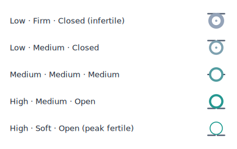
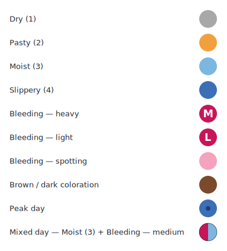
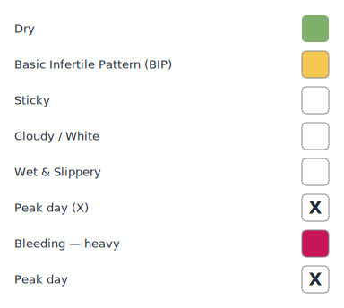
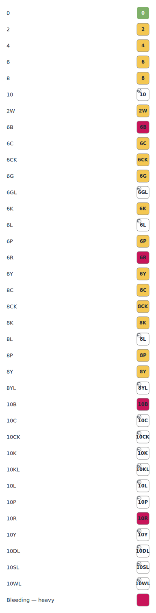
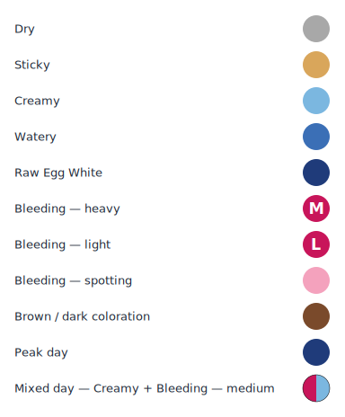

# hds-feminine-cycle-ui

Custom UI for cervical-fluid / cycle-tracking events in the HDS ecosystem — render the same data as **FEMM**, **Billings (BOM)**, **Creighton Model**, or **Mira** charts, plus a standalone glyph for cervical-position events.

Layout-agnostic. The same cell renderer is reused as a timeline marker, a form picker button, a diary-card glyph, or a calendar-grid cell. Hosts position it.

## Install

```bash
npm install hds-feminine-cycle-ui
```

Peer-dep: `react@^19`.

## Quick start

```tsx
import {
  RepresentationCell,
  composeCellInput,
  registry,
  CervixPositionMarker
} from 'hds-feminine-cycle-ui';

// 1. Cycle-fluid cell (FEMM / Billings / Creighton / Mira)
const rep = registry.get('femm');
const input = composeCellInput(eventsForADay, rep);
<RepresentationCell representationId='femm' input={input} size={24} />

// 2. Standalone cervical-position glyph (3-D vector → SHOW glyph)
<CervixPositionMarker height={1.0} firmness={0.5} openness={0.5} size={28} />
```

For force-conversion across methods (e.g. mira-source data displayed under FEMM), pass a `closestOption` callback that wraps the host's converter engine:

```tsx
const closestOption = (methodId: string, vectors: any) => {
  const engine = model.converters.getEngine('cervical-fluid');
  return String(engine.fromVector(methodId, vectors).data ?? '');
};
const input = composeCellInput(events, rep, { closestOption });
```

## What's in here

- A **registry** of cycle-fluid representations.
- A **pure function** (`composeCellInput`) that reduces N HDS events on a date to a single normalized cell input — supports half-and-half cells when both mucus and bleeding occur on the same day.
- A **peak/fertile detector** (`detectFertilityWindow`) — sliding-window over option keys.
- One **React component** (`RepresentationCell`) that draws a cell into a `size × size` SVG box; primitives `dot-circle` (FEMM/Mira) and `stamp-square` (Billings/Creighton) live inside it.
- A second **React component** (`CervixPositionMarker`) that draws a stylised cervix glyph from a 3-D vector — fixed centred ring, horizontal "horizon" bar moves with `height`, ring stroke width with `firmness`, inner-hole radius with `openness`. Standalone (not part of the spec/registry).
- A shared 7-day fixture (`samplePreviewEvents`) that any registered representation can render previews from.

## Built-in representations

| id          | primitive      | shipped | visual vocabulary |
|-------------|----------------|---------|-------------------|
| `femm`      | `dot-circle`   | v0.1    | [`docs/images/femm-options.svg`](./docs/images/femm-options.svg) |
| `billings`  | `stamp-square` | v0.2    | [`docs/images/billings-options.svg`](./docs/images/billings-options.svg) |
| `creighton` | `stamp-square` | v0.4    | [`docs/images/creighton-options.svg`](./docs/images/creighton-options.svg) · 33-code grid: [`docs/images/creighton-codes-grid.svg`](./docs/images/creighton-codes-grid.svg) |
| `mira`      | `dot-circle`   | v0.5    | [`docs/images/mira-options.svg`](./docs/images/mira-options.svg) |

Plus the standalone `CervixPositionMarker` glyph for `body-vulva-cervix-position` events (v0.7) — sample glyphs at [`docs/images/cervix-position-samples.svg`](./docs/images/cervix-position-samples.svg):



Three signals encoded in one 28-px glyph (SHOW mnemonic):

- **Height** → horizon-bar y position (Low = top of cell · High = bottom of cell).
- **Firmness** → ring stroke width (Soft = thin · Firm = thick).
- **Openness** → inner-hole radius (Open = large hole · Closed = solid + center dot).

Mean of the three tints the ring slate (infertile) → teal (fertile).

The `*-options.svg` files are auto-generated from the live spec by `npm run docs:images` (see [`scripts/render-method-images.mjs`](./scripts/render-method-images.mjs) and [`AGENTS.md`](./AGENTS.md#regenerating-docsimagesid-optionssvg)). Each shows the full mucus + bleeding + brown/dark + peak-day vocabulary with English labels (and a half-and-half mixed-day cell where the spec opts in). Run `npm run build && npm run docs:images` after editing a spec.

<table>
<tr>
<td align="center">FEMM<br></td>
<td align="center">Billings (BOM)<br></td>
</tr>
<tr>
<td align="center">Creighton Model<br></td>
<td align="center">Mira<br></td>
</tr>
</table>

## Documentation

- [`docs/concept.md`](./docs/concept.md) — abstraction model.
- [`docs/methods/femm.md`](./docs/methods/femm.md), [`billings.md`](./docs/methods/billings.md), [`creighton.md`](./docs/methods/creighton.md) — per-method palettes, mapping rules, sources.
- [`AGENTS.md`](./AGENTS.md) — operational notes for AI agents working on this repo.

Reference images live under `docs/images/`; per-method docs link to them.

## Status

`v0.7.0`. See [`CHANGELOG.md`](./CHANGELOG.md).

## License

BSD-3-Clause
